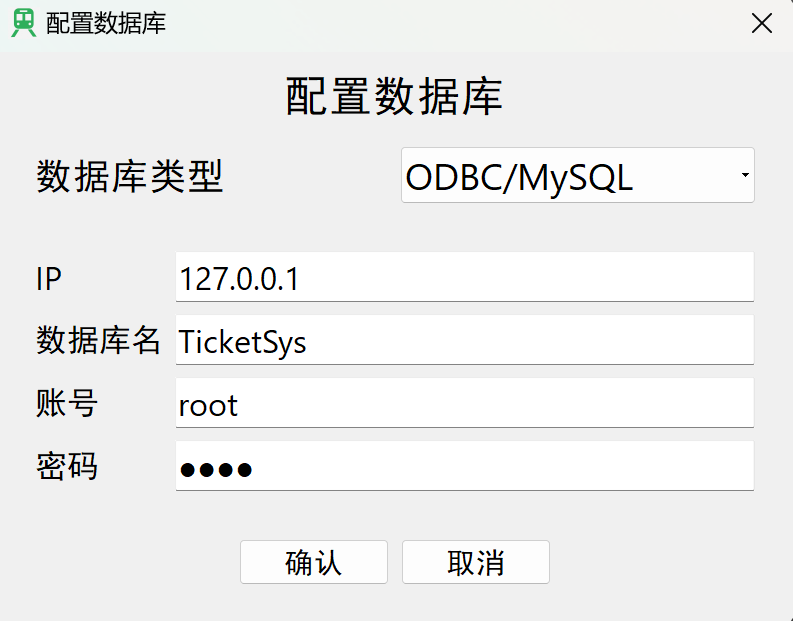
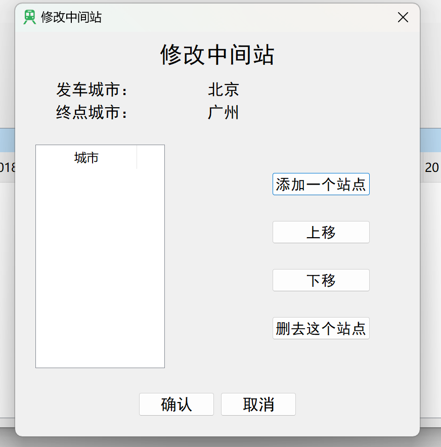
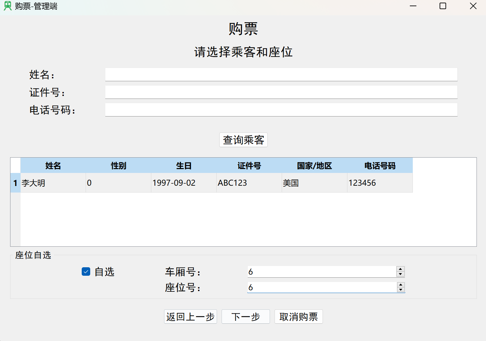
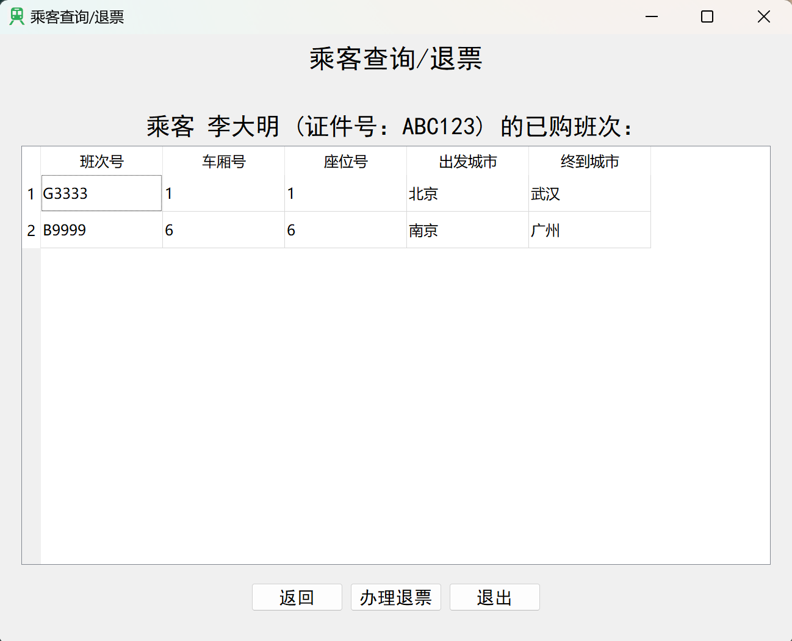
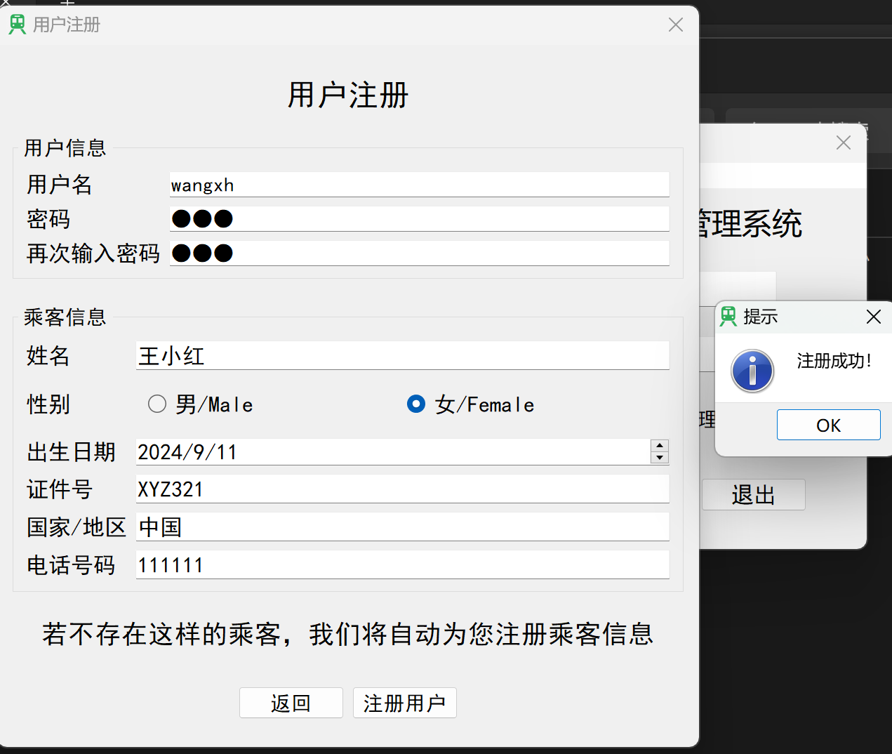

# Train Ticket Management System - Project Documentation

## Project Overview
This project is a train ticket management system based on the Qt framework and SQLite/MySQL databases. It implements core functions such as train schedule management, passenger management, ticket purchase and refund, and data query. The system has two roles: administrators and users, providing support for a complete business process.

## Project Information
| Project | Information |
| ------ | ------ |
|Developer Name | WeiKnight |
| Development Language | Simplified Chinese/ZH-CN |
| Development Cycle | August 2024 - September 2024 |
| Qt Version | 5.6.1 Community Edition |
| Qt Creator Version | 4.0.1 Community Edition |

## Functional Requirements
The system needs to implement the following functions:

1. **Train Schedule Management**
   - Management of basic schedule information (schedule number, departure time, departure/destination cities, number of carriages/seats, etc.)
   - Seat information management
   - Intermediate station management

2. **Ticketing Function**
   - Allocate seats for passengers
   - Support seat selection and automatic allocation
   - Seat conflict detection

3. **Ticket Refund Function**
   - Delete passenger ticket purchase information
   - Release seat resources

4. **Query Function**
   - Schedule query
   - Remaining ticket query
   - Passenger information query

5. **Data Persistence**
   - Support for SQLite/MySQL databases
   - Import and export of data files

6. **User System**
   - User registration/login
   - Password modification
   - Differentiation of administrator and ordinary user permissions

## System Design

### Database Design
The system uses 4 main tables and multiple groups of dynamic tables:

1. **Main Tables**
   - `trainclass`: Stores basic information about train schedules
   - `passengers`: Stores passenger information
   - `users`: Stores information about ordinary users
   - `admin`: Stores administrator information

2. **Dynamic Tables**
   - Each schedule corresponds to two tables:
     - `XXX`: Stores passenger information for this schedule (XXX is the lowercase schedule number)
     - `transform_XXX`: Stores station information for this schedule

### Class Design
The system includes 22 header files, 23 C++ source files, and 19 UI interface files. The main classes include:

1. **Core Classes**
   - `DataSystem`: Database operation class
   - `Train`: Train information class
   - `Passenger`: Passenger information class

2. **Interface Classes**
   - `Login`: Login interface
   - `MainWindow`: Administrator main interface
   - `userMainWindow`: User main interface
   - Various function dialogs (ticket purchase, refund, schedule management, etc.)

## Functional Modules

### 1. Login System
- Supports two login methods: user and administrator
- Database connection configuration
- User registration function

### 2. Administrator Functions
- Schedule management (add/modify/delete schedules)
- Passenger management (add/modify/delete passengers)
- Ticketing/refund operations
- Data import and export
- Schedule query and statistics

### 3. User Functions
- Ticket query and purchase
- Personal ticket refund
- Personal information modification

## Development Technologies
- Programming Language: C++
- Development Framework: Qt 5.6.1 Community
- Database: SQLite/MySQL
- Development Tool: Qt Creator

## Test Report

### Test Environment Configuration
1. Place the release version of the program and the `data` folder in the same directory.
2. `/data/traindb.db` is an initially empty database.
3. The test environment includes a complete database configuration interface.

### Functional Testing

#### 1. Database Connection Test
- Successfully connect to SQLite and MySQL databases
- Normal reading and writing of database files
- Normal function of default table creation




#### 2. Schedule Management Test
- Add schedule: Successfully created after entering complete information
- Modify schedule: Non-key fields can be modified, and key fields have a protection mechanism
- Intermediate station management: Supports addition, deletion, and sorting operations
- Delete schedule: Cascade delete related data tables




#### 3. Passenger Management Test
- Add passenger: Complete information entry, uniqueness check for ID numbers
- Modify passenger: Protection of key information for passengers who have purchased tickets
- Delete passenger: Passengers with ticket purchase records are prohibited from being deleted


#### 4. Ticketing Function Test
- Schedule query: Supports multi-condition combined queries
- Seat selection: Two modes: automatic allocation and manual selection
- Conflict detection: Sold seats cannot be selected repeatedly



#### 5. Ticket Refund Function Test
- Passenger ticket query: Displays all purchased tickets
- Ticket refund operation: Releases seats and updates the database
- Data consistency: Related tables are updated synchronously after ticket refund



#### 6. User Function Test
- Registration process: User and passenger information are created simultaneously
- Ticketing restrictions: Can only purchase tickets for oneself or specified passengers
- Ticket refund restrictions: Can only refund one's own tickets




## Project Summary

### Technical Achievements
1. Mastered GUI development technology under the Qt framework
2. Deeply understood database operations and SQL statement usage
3. Practiced object-oriented design patterns
4. Improved the ability of exception handling and input validation

### Project Highlights
1. Complete implementation of business processes
2. Rigorous data validation mechanism
3. User-friendly interface design
4. Flexible multi-database support

### Improvement Directions
1. Add more statistical report functions
2. Optimize performance under large data volumes
3. Enhance the system's concurrent processing capabilities
4. Add support for online ticket purchase

## Deployment Instructions

1. **Environment Requirements**
   - Windows/Linux system
   - Qt 5.6.1 runtime environment
   - SQLite3 or MySQL database

2. **Running Steps**
```
# Clone the project repository
git clone https://github.com/WeiKnight0/Qt-TrainTicketManagementSystem.git

# Open the project using Qt 5.6.1 Community Edition

# Configure the database
# Create an empty MySQL database
# Or directly open the program, and the program will automatically create an empty database

# Run the program
```

3. **Installation Instructions**
    
    There is no release version yet. It may be added in the future.

4. **Usage Instructions**
   - Create an administrator account for the first use.
   - Configure the database connection as needed.
   - It is recommended to back up the database file regularly.

## License
This project uses the GPL v3 and LGPL v3 open-source license, allowing free use and modification, but the original author information must be retained.