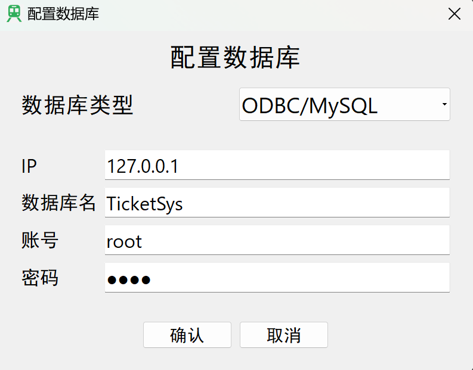
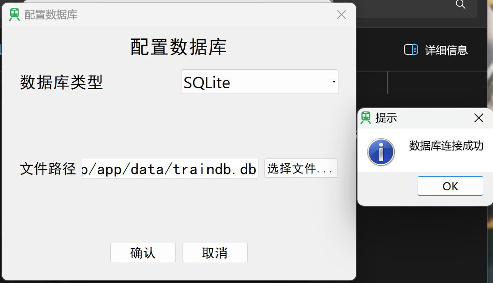
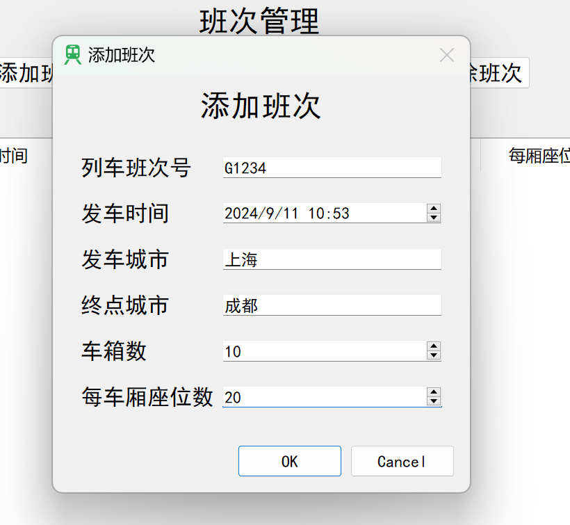
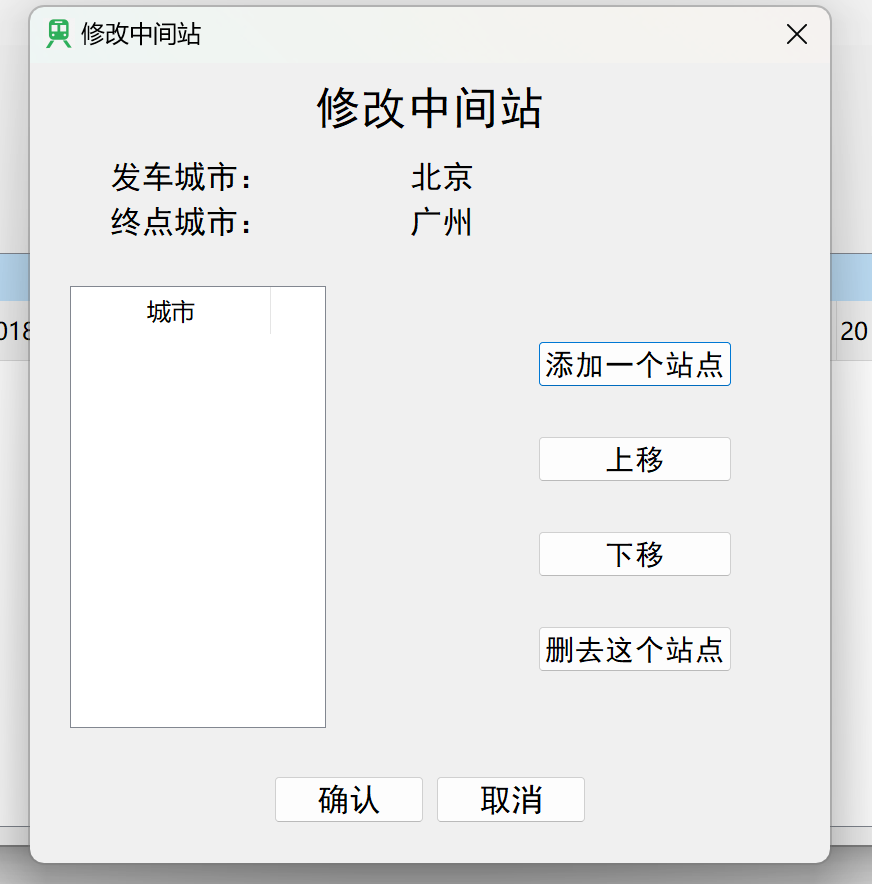
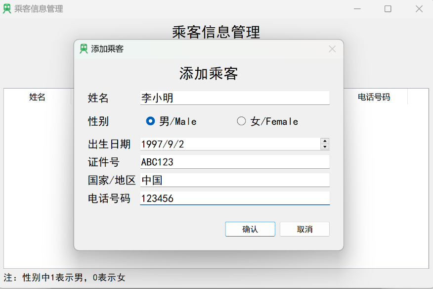
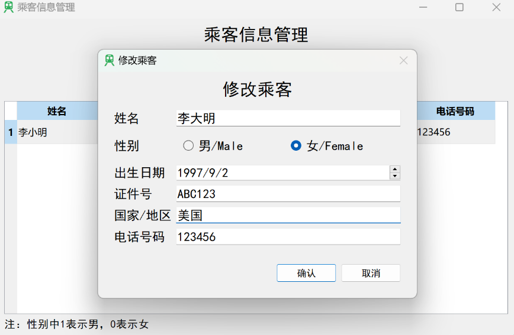
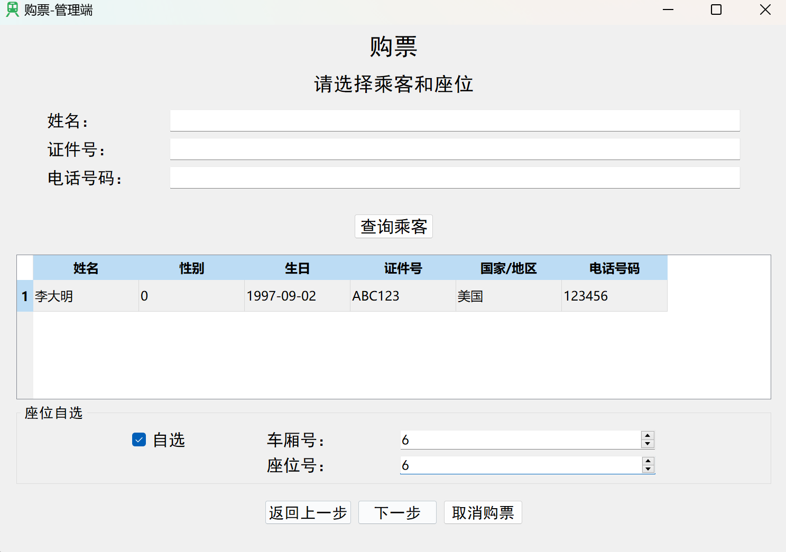
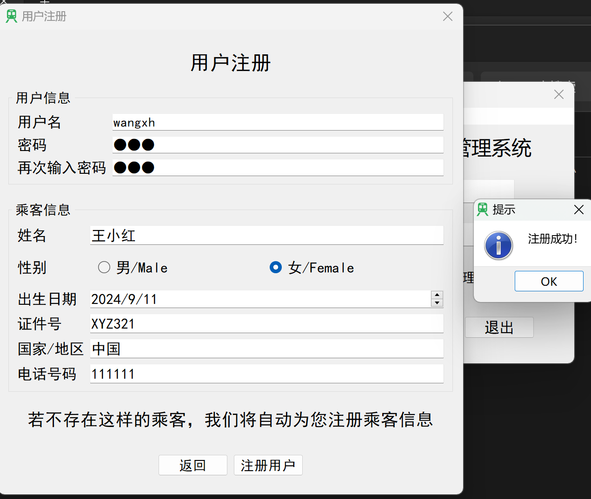
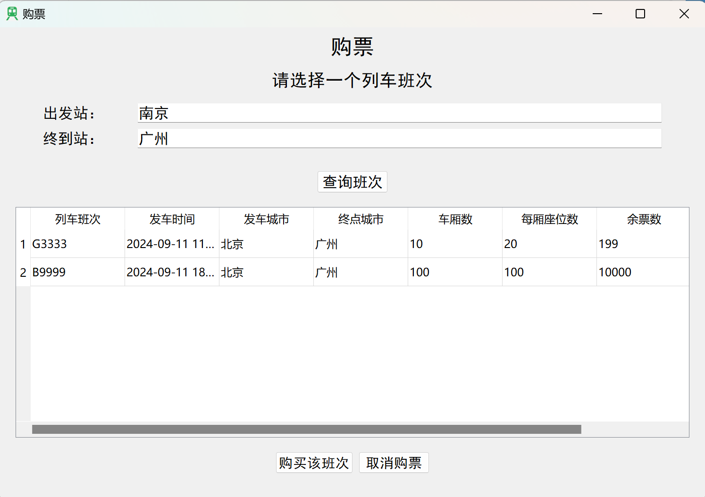
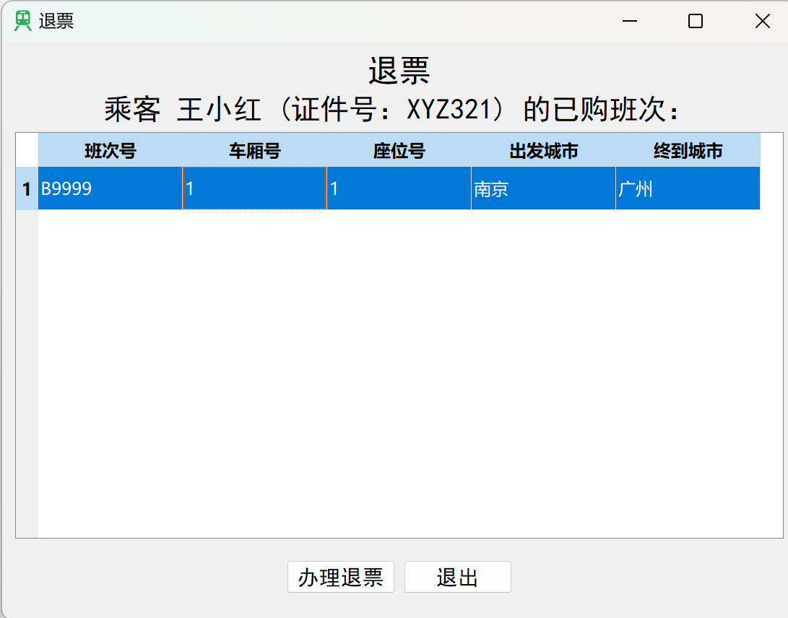

# 列车购票管理系统 - 项目文档
[**English**](README.md) | [简体中文](#)  
*(English version is available [here](README.md).)*
## 项目概述
本项目是一个基于Qt框架和SQLite/MySQL数据库的列车购票管理系统，实现了列车班次管理、乘客管理、购票退票、数据查询等核心功能。系统分为管理员和用户两种角色，提供完整的业务流程支持。

## 项目信息
| 项目 | 信息 |
|------|------|
| 开发者姓名 | WeiKnight |
|开发语言|简体中文/ZH-CN|
| 开发周期 | 2024年8月-2024年9月 |
|Qt版本|5.6.1社区版|
|Qt Creator版本|4.0.1社区版|

## 功能需求
系统需实现以下功能：

1. **列车班次管理**
   - 班次基本信息管理（班次号、发车时间、发车/终点城市、车厢/座位数等）
   - 座位信息管理
   - 中间站管理

2. **售票功能**
   - 为乘客分配座位
   - 支持自选座位和自动分配
   - 座位冲突检测

3. **退票功能**
   - 删除乘客购票信息
   - 释放座位资源

4. **查询功能**
   - 班次查询
   - 余票查询
   - 乘客信息查询

5. **数据持久化**
   - SQLite/MySQL数据库支持
   - 数据文件导入导出

6. **用户系统**
   - 用户注册/登录
   - 密码修改
   - 管理员与普通用户权限区分

## 系统设计

### 数据库设计
系统使用4个主表和多组动态表：

1. **主表**
   - `trainclass`：存储列车班次基本信息
   - `passengers`：存储乘客信息
   - `users`：存储普通用户信息
   - `admin`：存储管理员信息

2. **动态表**
   - 每个班次对应两张表：
     - `XXX`：存储该班次乘客信息（XXX为班次号小写）
     - `transform_XXX`：存储该班次站点信息

### 类设计
系统包含22个头文件、23个C++源文件和19个UI界面文件，主要类包括：

1. **核心类**
   - `DataSystem`：数据库操作类
   - `Train`：列车信息类
   - `Passenger`：乘客信息类

2. **界面类**
   - `Login`：登录界面
   - `MainWindow`：管理员主界面
   - `userMainWindow`：用户主界面
   - 各功能对话框（购票、退票、班次管理等）

## 功能模块

### 1. 登录系统
- 支持用户和管理员两种登录方式
- 数据库连接配置
- 用户注册功能

### 2. 管理员功能
- 班次管理（添加/修改/删除班次）
- 乘客管理（添加/修改/删除乘客）
- 售票/退票操作
- 数据导入导出
- 班次查询与统计

### 3. 用户功能
- 车票查询与购买
- 个人车票退订
- 个人信息修改

## 开发技术
- 编程语言：C++
- 开发框架：Qt 5
- 数据库：SQLite/MySQL
- 开发工具：Qt Creator

## 测试报告

### 测试环境配置
1. 将release版的程序和data文件夹放在同一目录下
2. `/data/traindb.db` 初始为空数据库
3. 测试环境包含完整的数据库配置界面

### 功能测试

#### 1. 数据库连接测试
- 成功连接SQLite和MySQL数据库
- 数据库文件读写正常
- 默认表创建功能正常




#### 2. 班次管理测试
- 添加班次：输入完整信息后成功创建
- 修改班次：可修改非关键字段，关键字段有保护机制
- 中间站管理：支持添加、删除、排序操作
- 删除班次：级联删除相关数据表




#### 3. 乘客管理测试
- 添加乘客：完整信息录入，证件号唯一性检查
- 修改乘客：已购票乘客关键信息保护
- 删除乘客：有购票记录的乘客禁止删除




#### 4. 售票功能测试
- 班次查询：支持多条件组合查询
- 座位选择：自动分配与手动选择两种模式
- 冲突检测：已售座位无法重复选择



#### 5. 退票功能测试
- 乘客车票查询：显示所有已购车票
- 退票操作：释放座位并更新数据库
- 数据一致性：退票后相关表同步更新


#### 6. 用户功能测试
- 注册流程：用户与乘客信息同时创建
- 购票限制：仅能为自己或指定乘客购票
- 退票限制：仅能退自己的车票





## 项目总结

### 技术收获
1. 掌握了Qt框架下的GUI开发技术
2. 深入理解了数据库操作和SQL语句使用
3. 实践了面向对象的设计模式
4. 提升了异常处理和输入验证的能力

### 项目亮点
1. 完整的业务流程实现
2. 严谨的数据验证机制
3. 友好的用户界面设计
4. 灵活的多数据库支持

### 改进方向
1. 增加更多统计报表功能
2. 优化大数据量下的性能表现
3. 增强系统的并发处理能力
4. 添加网络购票支持

## 部署说明

1. **环境要求**
   - Windows/Linux系统
   - Qt 5运行环境
   - SQLite3或MySQL数据库

2. **运行步骤**
   ```
   # 克隆项目仓库
   git clone https://github.com/WeiKnight0/Qt-TrainTicketManagementSystem.git

   # 使用Qt 5.6.1 社区版打开项目
   
   # 配置数据库
    # 创建空MySQL数据库
    # 或直接打开程序，程序自动创建空数据库
   
   # 运行程序
   ```

3. **安装说明**
    
    暂时没有release版。未来将添加。

4. **使用说明**
   - 首次使用请创建管理员账户
   - 按需配置数据库连接
   - 建议定期备份数据库文件

## 许可证
本项目采用GPL v3和LGPL v3开源协议，允许自由使用和修改，但需保留原作者信息。
